# :milky_way: Quantum Machine Learning for Drug Discovery
###  A Structure-Preserving Quantum Feature Map

## 📖 Overview
This project proposes **Isomorphic Quantum Feature Map** designed to improve the prediction of Blood-Brain Barrier Permeability (BBBP). Unlike classical fingerprints that "flatten" molecular data, our approach maps the exact 3D graph of a molecule onto a quantum circuit, preserving critical geometric information like **structural rigidity** and **polarity**.

## 🚀 Key Features
We treat the quantum computer as a physical simulator, not just a black box optimizer:
* **Atom Mapping ($R_Y$):** Atomic Electronegativity ($\chi$) is mapped to rotation angles ($\theta \propto \chi^2$).
* **Bond Mapping ($R_{XX}$):** Bond Orders (Single, Double, Aromatic) are mapped to entanglement strengths, physically simulating molecular stiffness.
* **Tail Compression:** A hybrid encoding scheme that compresses large molecular tails into final qubits to fit current hardware constraints.

### 📉 Hardware Benchmarking Results
Performance comparison across IBM Quantum backends with varying shot counts (measurement precision).

| Backend Device | Architecture | Accuracy (1024 Shots) | Accuracy (4096 Shots) | Performance Gain |
| :--- | :--- | :--- | :--- | :--- |
| **`ibm_marrakesh`** | Heron r2 (156q) | 72% | 86% | 🔼 **+14%** (Noise Mitigation) |
| **`ibm_torino`** | Heron r1 (133q) | 76% | 84% | 🔼 +8% |
| **`ibm_fez`** | Heron r2 (156q) | **86%** | **88%** | 🔼 +2% (Peak Fidelity) |

**Observation:** Higher shot counts significantly mitigated readout noise on lower-fidelity backends (like `marrakesh`), while the high-fidelity `ibm_fez` processor delivered consistent top-tier performance.
## 🛠️ Tech Stack
* **Qiskit:** Quantum circuit construction and runtime primitives.
* **RDKit:** Chemical informatics and graph extraction.
* **IBM Quantum:** Hardware execution (Eagle Processors).
* **Scikit-Learn:** SVM classification and benchmarking.

## 👥 Contributors
* **Mentee:** Anna K. Lindegren
* **Mentee:** Maral Mahmoudi Kamelabad
* **Mentee:** Abdul Hannan
* **Mentor:** Robert Loredo 

```mermaid
graph TD
    subgraph "1. Classical Pre-processing"
        A[SMILES String Input] --> B[RDKit Molecular Graph]
        B --> C{Feature Extraction}
        C --> D[Atom Electronegativity χ]
        C --> E[Bond Order W]
    end

    subgraph "2. Quantum Encoding"
        F[12-Qubit Ansatz]
        D -->|θ ∝ χ²| G[Ry Rotations: Identity]
        E -->|φ ∝ W| H[Rxx Gates: Structural Rigidity]
        I[Tail Compression] -->|Sum of χ²| J[Overflow Atoms 11+ Mapping]
        G & H & J --> F
    end

    subgraph "3. Execution & Evaluation"
        F --> K[IBM Quantum Backend: ibm_fez]
        K --> L[Kernel Matrix Estimation]
        L --> M[Quantum-Classical SVM]
    end

    subgraph "4. Output"
        M --> N{Permeability Prediction}
        N --> O[Pass: BBB Permeable]
        N --> P[Fail: Non-Permeable]
    end

    style F fill:#6236FF,stroke:#fff,stroke-width:2px,color:#fff
    style K fill:#0F62FE,stroke:#fff,stroke-width:2px,color:#fff
    style N fill:#24A148,stroke:#fff,stroke-width:2px,color:#fff
```

